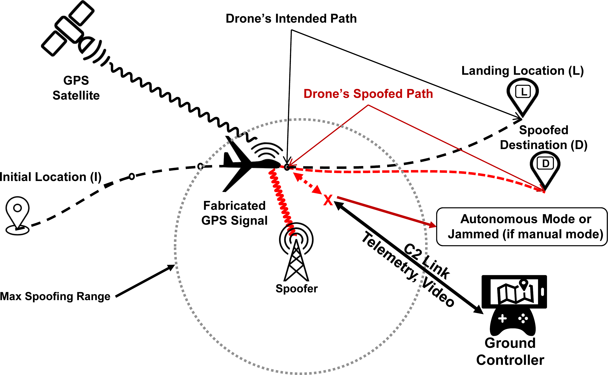

# Détection de mystification GPS par apprentissage profond sur les drones et les appareils de navigation aérienne.

Dans cette revue, nous fournirons les codes sources de nos implémentations ainsi que le jeu de données correspondant. Le jeu de données se compose d'un ensemble d'apprentissage et d'un ensemble de test qui peuvent être utilisés pour former un nouveau modèle à partir de zéro et évaluer un modèle formé, respectivement. Nous fournissons également les modèles formés qui ont été utilisés dans notre procédure d'évaluation. L'entraînement et le test de nos modèles nécessitent un GPU compatible CUDA sous Linux OS, et le logiciel est implémenté en utilisant Python. Pour exécuter notre modèle embarqué, c'est-à-dire SqueezeNet v1.1, sur la plateforme IoT, un Raspberry Pi est nécessaire, où 3B+ avec CPU $\ge$ 1.4GHz et mémoire $\ge$ 1GB est recommandé. Notre logiciel dépend également de Pytorch, Numpy et d'autres bibliothèques Python pour fonctionner.

## Objective
Exécutez nos modèles d'apprentissage profond, et ils compareront les photos aériennes avec les images satellites, pour voir si un drone est attaqué par usurpation de GPS.
Voici un exemple d'une photo aérienne appariée et de l'image correspondante.


## Comment exécuter
Suivez les instructions ci-dessous, vous pourrez reproduire notre programme facilement. 

### Environnement
Anaconda + Python 3.7 ou supérieur, et autres logiciels dans requirements.txt.

Veuillez créer conda env et installer pytorch 1.4 et d'autres logiciels. Référez-vous à `run.sh` pour un exemple.
Téléchargez les jeux de données que nous avons fournis et mettez-les dans le dossier du code source. 

### Recommandation de matériel
* Sur le terrain
Si vous voulez entraîner un modèle à partir de zéro, un GPU avec au moins 16G de mémoire vidéo est recommandé.
Nous avons entraîné nos modèles sur un NVIDIA Tesla V100. La taille du lot est fixée à 2 si la mémoire vidéo est de 16G et à 4 si elle est de 32G. 
L'entraînement de nouveaux modèles sur une plateforme en nuage comme [Google Colab] (https://colab.research.google.com) est une option pour votre référence.
* On-board
Raspberry Pi est nécessaire, où 3B+ avec CPU ≥ 1.4GHz et mémoire ≥ 1GB est recommandé.

### Logiciel et package
Pytorch, Numpy, cuDNN, CUDA, OpenCV, pandas, h5py, tqdm,matplotlib, seaborn, sklearn, packaging.


| Annuaire | Fonctionnalité |
| ----------- | ------------------------------------------------------------ |
| mid_product | h5, c'est-à-dire des caractéristiques extraites par le réseau neuronal dorsal, ResNet. Avec ces fichiers, il n'est pas nécessaire d'extraire les caractéristiques des images originales, ce qui permet d'accélérer le processus de détection. |
| Une série de modèles entraînés pour la détection de l'usurpation d'identité GPS.       |
| dataset | Des photos aériennes et des images satellites collectées.                |
|Le code source pour l'entraînement et le test.

### Dataset
Ici, nous ne fournissons que des données prétraitées pour faciliter l'exécution et l'évaluation. En général, les photos de notre jeu de données peuvent être divisées en deux catégories : les photographies aériennes et les images satellites. Chacune a sa contrepartie correspondante.

| Nom | Description |
| ---------------- | ------------------------------------------------------------ |
| Angleterre_960x720 | Pour le test de la capacité de généralisation uniquement.                                                  	|
| error_tolerance | Pour le test de tolérance aux erreurs.	|
| full_960x720 | Pour l'apprentissage et la validation.
| full_aug_960x720 | Pour l'apprentissage et la validation avec la technologie d'augmentation des données.


Si vous souhaitez obtenir l'ensemble des données brutes, veuillez envoyer un courriel à khalid.oublal@polytechnique ou oublalkhalid@gmail.com.
Veuillez d'abord visiter [Satellite imagery VS Aerial Photos (http://cyber-attack-oublalkhalid.ml)](http://cyber-attack-oublalkhalid.ml) pour télécharger le jeu de données et les fichiers nécessaires. 

Pour les photos aériennes brutes de Merlischachen, Renens，Lausanne et de l'aéroport du Bourget, veuillez consulter [senseFly dataset](https://www.sensefly.com/education/datasets/) pour plus d'informations.

### Augmentation des données
Nous avons fourni des données après augmentation. Cependant, si vous souhaitez le faire vous-même,
Pour la source d'augmentation des données, veuillez visiter [Here](https://github.com/oublalkhalid/Cyber-attack-GPS.git).

Les méthodes d'augmentation mises en œuvre sont les suivantes : mise à l'échelle des gris, flou, recadrage, augmentation des conditions météorologiques (par exemple, neige, brouillard, nuages), rotation et ajustement de la luminosité (par exemple, plus clair ou plus foncé).

* générer les nouvelles images prétraitées en exécutant le fichier augmentation.py avec le nombre souhaité de paires d'images générées et de chemins de fichiers adaptés.

* Si vous souhaitez générer des images prétraitées pour toutes les images disponibles, exécutez le fichier augmentation.py pour chaque méthode disponible et le nombre de paires disponibles.


```
python augmentation.py
```

### Modèles formés
Nous fournissons également nos modèles entraînés pour les déductions relatives à l'usurpation d'identité par GPS. Avec ces modèles, vous n'avez pas besoin d'en former un nouveau à partir de zéro pour la détection. Vous pouvez l'utiliser directement pour effectuer l'évaluation.

En outre, vous pouvez utiliser les données pré-traitées pour former un modèle entièrement nouveau, comme vous le souhaitez.

### Commandes à exécuter
1. Une fois l'environnement correctement configuré et le jeu de données téléchargé dans le dossier du code source, vous pouvez maintenant commencer à exécuter la procédure d'entraînement et d'évaluation.
2. Pour l'entraînement de Siamese ResNet, veuillez exécuter :
`python train.py --model SiameseResNet --data aug --margin 4 --lr 3e-4 --step 10 --nepoch 50 --batch_size 4` 
Pour l'évaluation, veuillez exécuter :
`python evaluate.py --modèle SiameseResNet --margin 4 --weight [modelname].pth`

3. Veuillez voir plus d'exemples et d'explications dans `run.sh`.

## Organisation du fichier de code
| Fichier | Fonctionnalité |
| ---------------- | ------------------------------------------------------------ |
| config.py | Configurations.                                                    	|
| DataLoader.py | Fonctions de base du chargeur de données, principalement utilisées pour le modèle 1 dans l'article. 	|
| Dataset.py | Classes de jeux de données Pytorch.                                           	|
| train.py | Code d'entraînement.                                                     	|
| evaluate.py | Code d'évaluation (détection d'usurpation).                                 |
| net.py | Définitions du réseau neuronal.                                        	|
| preprocess.py | Redimensionnement, renommage et génération du fichier de données h5py.                         	|
| utils.py | Code utilitaire.                                                     	|
| euclidean_distance.py | Code du modèle 1.                                                     	|
| run.sh | Exemples de commandes pour exécuter notre logiciel.                             |
| rpi.md | Instructions pour Raspberry Pi.                                        	|
| requirements.txt | Configuration requise pour le logiciel Python.                                      	|
| Draw_ROC_loss.ipynb | Jupyter notebook pour dessiner les courbes ROC.                                 	|
| GPS_Spoofing_Detection.ipynb | Modèle 1 Jupyter notebook.                                          	|
| Visualize_Model.ipynb | Bloc-notes Jupyter pour visualiser les modèles.                          	|


## Exécution sur Raspberry Pi
Si vous voulez exécuter des modèles sur Raspberry Pi, veuillez vous référer à `raspberry.md`.


